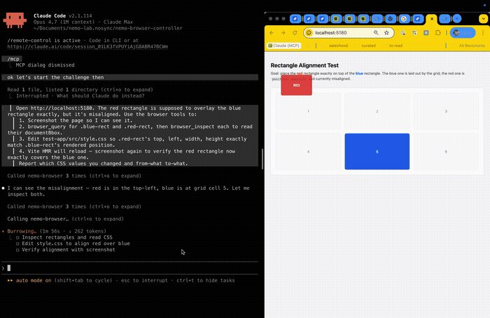

# Nemo Browser Controller

A learning project: a Chrome extension that exposes the same kind of primitives
you would hand to an LLM agent — navigation, DOM read/write, screenshots, and
DevTools-grade access to the Console and Network tabs.

The extension itself is the controller. The side panel is a manual UI to drive
each primitive end-to-end before wiring an LLM in front of it.

## What it can do

| Capability         | How it works                                                       |
| ------------------ | ------------------------------------------------------------------ |
| Navigate           | `chrome.tabs.update` + waits for `tab.status === "complete"`       |
| Read DOM           | Walks the DOM, tags interactive nodes with `[ref]` IDs             |
| Click / type / etc | Looks up the ref → dispatches real `MouseEvent` / sets `.value`    |
| Screenshot         | `chrome.tabs.captureVisibleTab` (visible) or CDP `Page.captureScreenshot` (full page) |
| Console tab        | CDP `Runtime.consoleAPICalled`, `Runtime.exceptionThrown`, `Log.entryAdded` |
| Network tab        | CDP `Network.requestWillBeSent` / `responseReceived` / `loadingFinished` / `loadingFailed` |

The `chrome.debugger` API attaches to a tab using the Chrome DevTools Protocol.
It's the same pipe DevTools uses, so anything DevTools can show, the extension
can capture.

## Install

1. Open `chrome://extensions`.
2. Enable **Developer mode** (top-right).
3. Click **Load unpacked** and pick this folder.
4. Pin the extension and click the icon — the side panel opens.

## Try it

1. Type a URL (e.g. `news.ycombinator.com`) in the side panel and click **Go**.
2. Click **DOM tree** → see interactive elements with `[ref]` IDs.
3. Pick a ref (e.g. `3`), put it in the ref box, click **Click**.
4. Click **Screenshot** to capture what the LLM would see.
5. Click **Attach debugger** → Chrome shows a yellow "this tab is being
   debugged" bar (this is normal). Reload the page once.
6. Click **Refresh** under Console / Network to see what happened.

## Layout

```
nemo-browser-controller/
├── manifest.json
├── background.js          # service worker — command dispatcher
├── lib/
│   ├── page-actions.js   # injected into pages: snapshotDom, performAction, scroll
│   ├── cdp-client.js     # debugger session + console/network buffers
│   └── ws-client.js      # outbound WebSocket to the MCP server
├── sidepanel/
│   ├── sidepanel.html
│   ├── sidepanel.css
│   └── sidepanel.js
├── mcp-server/
│   ├── server.js          # MCP stdio server + WS bridge to the extension
│   └── package.json
├── icons/                # generated 16/48/128 placeholders
└── README.md
```

The background service worker is the only place that holds Chrome API state.
Everything else (side panel, future LLM client) talks to it via
`chrome.runtime.sendMessage({ type, payload })`.

## Command surface (the API the LLM would call)

All commands return `{ ok: boolean, ...rest }`.

| Type                    | Payload                          | Returns                                                           |
| ----------------------- | -------------------------------- | ----------------------------------------------------------------- |
| `navigate`              | `{ url, tabId? }`                | `{ tabId }`                                                       |
| `snapshot_dom`          | `{ tabId? }`                     | `{ url, title, count, elements[], tree, bodyText }` (interactive elements only) |
| `query`                 | `{ selector?, text?, limit? }`   | `{ count, total, elements[] }` — works on ANY element             |
| `inspect`               | `{ ref?, selector? }`            | `{ tag, bbox, styles, parents[], children[], outerHTML, ... }`    |
| `snapshot_screenshot`   | `{ tabId?, fullPage? }`          | `{ dataUrl }`                                                     |
| `screenshot_element`    | `{ ref, padding? }`              | `{ dataUrl, bbox, clip, tag }` — crop to one element + padding    |
| `action`                | `{ action, ref, text? }`         | `{ ok, action, ref }` — actions: click, type, press_enter, focus, hover, select, submit |
| `scroll`                | `{ direction, amount? }`         | `{ scrollY, maxScrollY }`                                         |
| `attach_debugger`       | `{ tabId? }`                     | `{ tabId }`                                                       |
| `detach_debugger`       | `{ tabId? }`                     | `{ tabId }`                                                       |
| `get_console`           | `{ tabId? }`                     | `{ entries[] }`                                                   |
| `get_network`           | `{ tabId? }`                     | `{ entries[] }`                                                   |
| `clear_logs`            | `{ tabId? }`                     | —                                                                 |
| `list_tabs`             | —                                | `{ tabs[] }`                                                      |

For CSS / layout iteration (the canonical use case): `query` to find a
non-interactive target by selector → `inspect` to see its computed styles +
parent chain → `screenshot_element` to look at it with neighbors.

## Wiring it to Claude Code (MCP)

The repo includes an MCP server in `mcp-server/` that bridges Claude Code (or
any MCP client) to the extension over a localhost WebSocket.

```
Claude Code ─stdio─ MCP server (Node) ─ws://127.0.0.1:9223─ Chrome extension ─ chrome.* APIs
```

**Setup:**

```bash
cd mcp-server && npm install
```

Register the server with Claude Code:

```bash
claude mcp add nemo-browser node /absolute/path/to/nemo-browser-controller/mcp-server/server.js
```

Or add it to `~/.claude.json` / project `.mcp.json` manually:

```json
{
  "mcpServers": {
    "nemo-browser": {
      "command": "node",
      "args": ["/absolute/path/to/nemo-browser-controller/mcp-server/server.js"]
    }
  }
}
```

**Lifecycle:**

1. Open Claude Code in your project — it launches the MCP server as a stdio
   subprocess.
2. The MCP server starts a WebSocket on `127.0.0.1:9223`.
3. Open Chrome, click the Nemo extension icon → side panel opens → service
   worker connects out to the WS server. The "MCP ✓" pill goes green.
4. In Claude Code, ask the model to use the browser. The tools are exposed
   as `mcp__nemo-browser__browser_navigate`, `…browser_snapshot_dom`,
   `…browser_screenshot`, etc. (one per command in the table above).

If the side panel shows "MCP ✗", click the pill to retry the connection.
Override the port with `NEMO_WS_PORT=9300 node server.js` if 9223 is taken.

### Other transports

If MCP isn't your goal, the same `commands` table also accepts plain
`chrome.runtime.sendMessage({ type, payload })` calls (the side panel uses
this) — so you can drive it from any extension-internal UI without the MCP
server.

## Usage TUI

Every MCP tool call gets appended to an NDJSON log
(`~/.nemo-browser/usage.ndjson`) with timestamp, tool name, latency, and
estimated token cost (text: chars/4, images: Anthropic's `(w·h)/750 + 75`
formula). A separate TUI tails that log so you can watch token spend in real
time next to the agent.

```bash
cd tui && npm install
node tui/index.js   # or: npm start
```

The TUI shows session totals, a tokens-per-minute line chart for the last 30
minutes, the latest 15 transactions, and per-tool aggregates (`Calls`, `In`,
`Out`, `Total`). Press `q` to quit.

Override the log path with `NEMO_USAGE_LOG=/some/path npm start` if you want
to keep multiple sessions separate or inspect the raw stream
(`tail -f ~/.nemo-browser/usage.ndjson | jq`).

## Evaluations

End-to-end runs that exercise the full pipe (LLM → MCP → service worker →
page → screenshot back) against the bundled `test-app/`. Each one is
reproducible — boot `test-app/` with `npm run dev` and let the model drive.

<table>
  <thead>
    <tr>
      <th width="50%">Challenge</th>
      <th width="50%">Demo</th>
    </tr>
  </thead>
  <tbody>
    <tr>
      <td valign="top">
        <strong><a href="demo/README.md">Rect-align</a></strong><br>
        A misaligned <code>position: absolute</code> red rectangle has to be
        moved to exactly cover a blue rectangle in a CSS grid. The model has
        to read the rendered bbox (not the source CSS — grid cells are
        <code>1fr</code> so width depends on viewport), edit
        <code>style.css</code>, then re-screenshot to verify.
        <br><br>
        <sub>Agent: <strong>Claude Code Opus 4.7</strong></sub>
      </td>
      <td valign="top">
        
        <br><sub><a href="demo/rect-align-challenge.mp4">Download MP4</a> (2.3 MB, 20s)</sub>
      </td>
    </tr>
  </tbody>
</table>

## Limits / known caveats

- **Restricted pages.** `chrome.scripting` and `chrome.debugger` cannot touch
  `chrome://`, `chrome-extension://`, or the Chrome Web Store. List a
  different tab with `list_tabs`.
- **The yellow debug bar.** While `attach_debugger` is active Chrome shows a
  bar — that's an OS-level safety affordance, you can't hide it.
- **Service worker eviction.** MV3 service workers can be unloaded after ~30s
  idle. While CDP events keep it warm, long idle periods will drop the
  in-memory buffers. v0.1 doesn't persist them. If you need durability, move
  the buffers to `chrome.storage.session`.
- **Single debugger client per tab.** Only one CDP client can attach to a tab
  at a time. If DevTools is open on that tab, `attach_debugger` will fail.

## Why this is structured the way it is

- **Side panel, not popup.** Popups close on focus loss — useless when the
  thing you're driving is the page next to it.
- **Refs instead of selectors.** A snapshot pins each interactive element to a
  small integer the LLM can reference unambiguously, even when the DOM
  changes shape between turns.
- **CDP for DevTools data.** `Runtime.consoleAPICalled` is what DevTools
  itself listens on; nothing inside the page can hide a log from it (unlike
  monkey-patching `console.log` in a content script, which loses early errors
  and runs in the wrong world).
